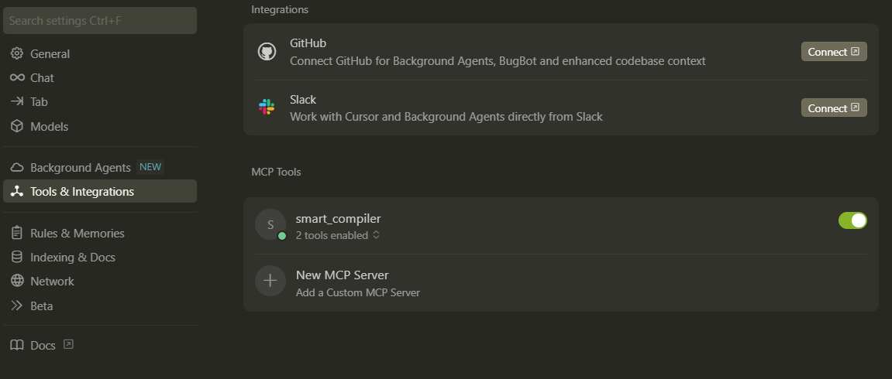
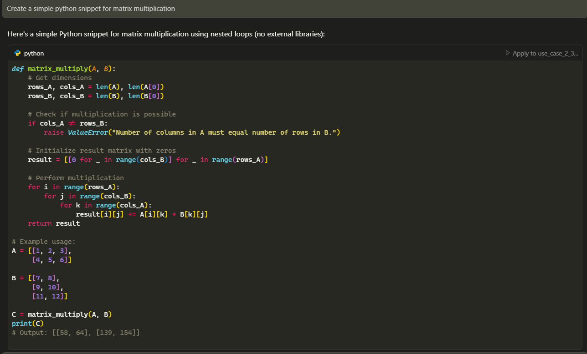
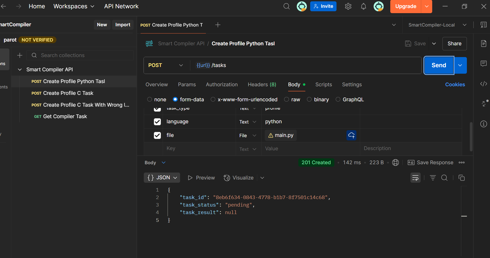
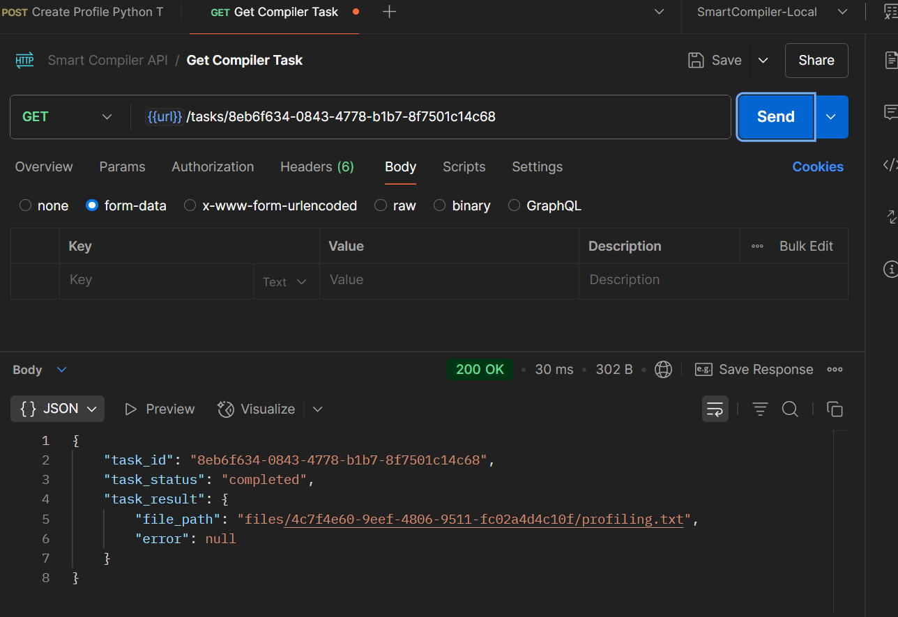
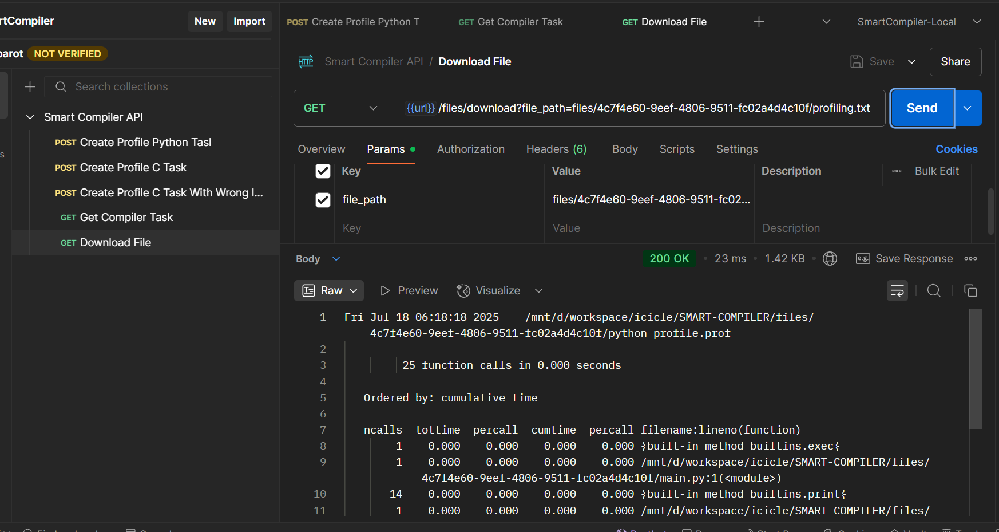

# Smart Compiler Infrastructure

This project introduces an agentic approach for high-level 
and multi-purpose compilers.CI4AI.

# TUTORIALS

This Smart Compiler uses AI models and traditional compiler techniques to enhance the performance scalability of C programs and Python programs. By profiling, and finding approaches for optimizations.

# Sofwate Requirements

## Install the project
For dependency management and installation, this project uses ```uv```.
See [Astral Documentation](https://docs.astral.sh/uv) for installing the uv package manager.


## Project dependencies

### Packages
After installing **uv** run: ```uv sync``` for syncing project dependencies. 

If you do not want to use `uv` for dependencies maangement, you can install dependencies from the **requirements.txt** file. 
You can run `pip install -r requirements.txt` 

### Ollama
To deploy a LLM using ollama first we need to install Ollama by following 
its [Official Documentation](https://ollama.com).

Once Ollama is installed deploy the Ollama server (if it was not deployed by the installation).


### Quick Ollama deploy
1. Serve the Ollama server: ```ollama serve``` (if it is not already deployed).
2. Create LLM model using the SmartCompiler Modelfile: ```ollama create llama3.1-smart-compiler -f ollama-smart-compiler-Modelfile```.
3. Run the created LLM: ```ollama run llama3.1-smart-compiler:latest```.
4. If it opens a chat after running the LLM, just type ```/bye``` to close that chat.

#### Setting up Environment variables
Set up the environment variables in a ```.env``` file.
An example of how this file looks like.
```
# For client, see envs/.client.example.env
# .env
LOG_LEVEL=INFO
OLLAMA_MODEL=llama3.1-smart-compiler:latest
OLLAMA_HOST=http://localhost:11434
MCP_SERVER_URL=http://localhost:8000/sse
ALLOWED_PATHS="/mnt/d/workspace/python/smart-compiler/examples"
```

```
For Server, see envs/.server.example.env
LOG_LEVEL=INFO
OLLAMA_MODEL=llama3.1:latest
OLLAMA_HOST=http://localhost:11434
MCP_SERVER_HOST=0.0.0.0
MCP_SERVER_PORT=8000
MCP_SERVER_TRANSPORT=sse
ENABLE_REST_API=true
ALLOWED_PATHS="/mnt/d/workspace/python/smart-compiler/examples"

```


Then type : export $(cat .env | xargs) on Linux to load the env variables or just source in Windows


# How-To Guides


## Running the project
For running the project, once all dependencies and configurations are set, run the following command:

## SERVER

Run the server

```bash
python src/run_server.py

```

## CLIENT
Run the client.

Note: This client is a simple version that extends Llama model for using tools. Since the client is not robust enough, we encourage you using other more robust tools such as Claude desktop, Copilot or ChatGPT with MCP tools.

Smart compiler client is a PoC.

```bash
python src/run_client.py

```

Then the smart compiler will ask the user to provide the folder of the project that the user will be working on. Please provide a path example : /home/directory/projectAI

Then the smart compiler will ask which specific file will the smart compiler work on: type the name fo the file, exmaple : api_server.py

Then the smart compiler will ask which specific task to do: Profile or Optimize. Type what you would like to do with the program.

## USE CASES
### MCP Tool + Cursor or Claude Desktop
First we need to setup our variables in a certain local env, for example ```local.server.env```
```bash
LOG_LEVEL=INFO
OLLAMA_MODEL=llama3.1:latest
OLLAMA_HOST=http://localhost:11434 # Or where you are hosting the model
MCP_SERVER_HOST=0.0.0.0
MCP_SERVER_PORT=8000
MCP_SERVER_TRANSPORT=stdio #
ENABLE_REST_API=false
ALLOWED_PATHS="{SOME_PATH}/smart-compiler/examples"
```

```json
//cursor example
{
  "mcpServers": {
    "smart_compiler": {
      "url": "http://localhost:8000/sse",
      "env": {}
    }
  }
}

// claude example...
{
  "mcpServers": {
    "smart_compiler":{
      "command": "uv",
      "args": [
        "--directory",
        "{SMART_COMPILER_PATH}",
        "run",
        "src/run_server.py"
      ],
      "env": {
        "UV_PROJECT_ENVIRONMENT": "{SMART_COMPILER_PATH}",
        "UV_ENV_FILE": "{SMART_COMPILER_PATH}/envs/.local.mcp_server.env"
      }
    }
  } 
}

```

Check if the server was properly deployed or connected to:


Ask Claude to produce a certain code snippet...



And then try to ask it to profile your code.




### As a Monitoring Tools Provider
First we need to setup our variables in a certain local env, for example ```local.server.env```

We need to enable the flag **ENABLE_REST_API** which allows us to deploy the SmartCompiler API.

```bash
LOG_LEVEL=INFO
OLLAMA_MODEL=llama3.1:latest
OLLAMA_HOST=http://localhost:11434 # Or where you are hosting the model
MCP_SERVER_HOST=0.0.0.0
MCP_SERVER_PORT=8000
MCP_SERVER_TRANSPORT=stdio #
ENABLE_REST_API=true # MAKE SURE this is enabled
ALLOWED_PATHS="{SOME_PATH}/smart-compiler/examples" #path the server will have access to
```

Once deployed, you will be able to see the documentation hosted at `http://localhost:8000/docs`.

For trying our Postman collections, visit the [Smart Compiler GitHub repository](https://github.com/ICICLE-ai/smart-compiler).


#### Scheduling a profiling task
From a monitoring system, you can schedule a profiling task to collect information about a certain code snippet or program.

For this example we will use one of the provided codes within this repository. You can find this code at `examples/matrix-multiplication/main.py`



Once the profiling task has been scheduled, you will be able to lookup its status:



Finally, we can get access to the profiling content through the API:



#### Scheduling an optimization task:
This is currently in development.


## Running from containers
### Building images.
Build the smart compiler server and client by running the scripts:

```bash
docker build -f Server_dockerfile -t smart_server . #For SERVER
docker build -f Client_dockerfile -t smart_client . #For Client
```

**Note:** By default, the dockerfiles are configured for localhost deploy. If you are planning to deploy it in a distributed architecture, you need to make sure on setting up the proper env variables inside the dockerfiles.

### Running containers
For running the smart server you can run the following script.
```bash
docker run -d --name smart_server -p 8000:8000 smart_server #Server
docker run -it --name smart_client -p 8001:8001 smart_client #Client. Remember -it

```

### Explanation

Details about the smart compiler can be found on the following diagramas:
- **Diagrams**:  
  - [Diagram 1](https://drive.google.com/file/d/1S5gRxw_vizR1XnmbiZnAH1yZnkB8Ep0_/view?usp=drive_link)  
  - [Diagram 2](https://drive.google.com/file/d/1tgCcINlzBUe6A1PCNX6R_ftAnb9WidcA/view?usp=sharing)

## References

To deploy a LLM using ollama first we need to install Ollama by following 
its [Official Documentation](https://ollama.com)

## Acknowledgements

National Science Foundation (NSF) funded AI institute for Intelligent Cyberinfrastructure with Computational Learning in the Environment (ICICLE) (OAC 2112606)


## Internal Notes

### To extract Modelfile

```ollama show --modelfile llama3.1 > Modelfile```

### To create from Modelfile

```ollama create llama3.1-tool -f Modelfile```
